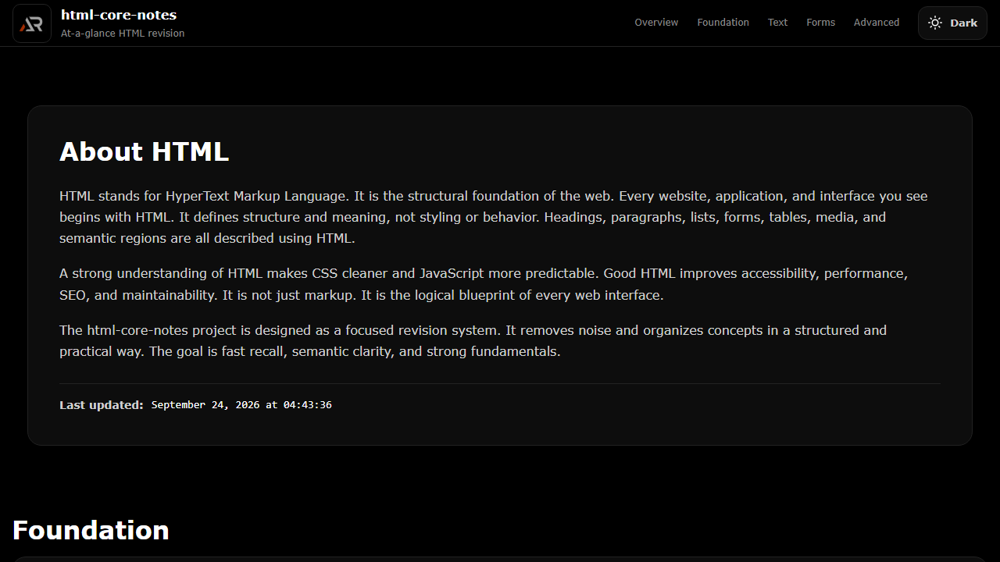

# HTML Core Notes



A single-page HTML revision guide for fast, practical learning. It organizes core concepts into expandable topic cards covering structure, semantics, content, forms, media, accessibility, metadata, performance, SEO, and security.

## Features

- Structured HTML notes grouped by learning category
- Expandable topic cards with practical examples
- Searchable topic map and quick navigation
- Dark and light themes saved in local storage
- Fixed header with mobile quick navigation
- Independent content scroll with a floating scroll-to-top control
- Icon-only developer and support links in the footer

## Tech Stack

React, Vite, styled-components, react-icons, and CSS custom properties.

## Run locally

```bash
npm install
npm run dev
```

## Deployment

```bash
npm run build
npm run deploy
```

Live app: [https://a2rp.github.io/html-core-notes/](https://a2rp.github.io/html-core-notes/)

## Links

- Portfolio: [https://www.ashishranjan.net](https://www.ashishranjan.net)
- GitHub: [https://github.com/a2rp](https://github.com/a2rp)
- CodePen: [https://codepen.io/ash1198](https://codepen.io/ash1198)
- LinkedIn: [https://www.linkedin.com/in/aashishranjan](https://www.linkedin.com/in/aashishranjan)
- Facebook: [https://www.facebook.com/theash.ashish/](https://www.facebook.com/theash.ashish/)
- YouTube: [https://www.youtube.com/@ashishranjan-ashz?sub_confirmation=1](https://www.youtube.com/@ashishranjan-ashz?sub_confirmation=1)
- Email: [ash.ranjan09@gmail.com](mailto:ash.ranjan09@gmail.com)

## Support

- Support: [https://a2rp-donation-page.netlify.app/](https://a2rp-donation-page.netlify.app/)
- Buy Me A Coffee: [https://buymeacoffee.com/a2rp](https://buymeacoffee.com/a2rp)
- Patreon: [https://patreon.com/a2rp](https://patreon.com/a2rp)
